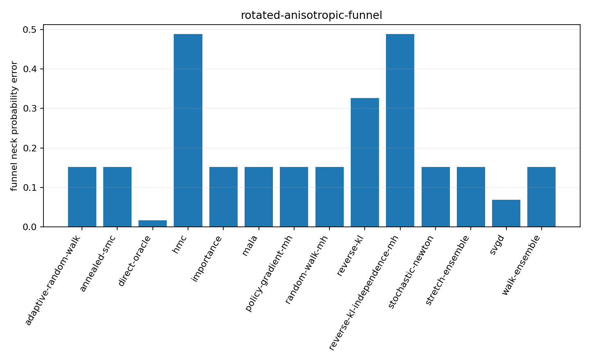

# Sampler Lab

Sampler Lab is a from-scratch Monte Carlo methods library and experiment suite. The project
emphasizes transparent algorithms, explicit random-number state, stable log-domain calculations,
and mathematical validation.



The fixed-seed quick benchmark deliberately exposes funnel-neck error and other method-specific
failure modes. See the [reference benchmark summary](reference/continuous_benchmark/benchmark_summary.md)
for the full comparison.

## What is implemented

- exact transforms and rejection sampling;
- importance sampling and rare-event twisting;
- sequential importance sampling, resampling, and particle ancestry;
- finite-state Markov theory and exact asymptotic variance;
- Metropolis--Hastings, Gibbs, Ising, Langevin, HMC, and underdamped methods;
- annealed importance sampling and annealed SMC;
- conditioning, stochastic Newton, and affine-invariant ensembles;
- adaptive MCMC and policy-gradient proposal learning;
- variational and Stein methods with explicit exact-versus-approximate labels;
- a capability-aware cross-method benchmark on Gaussian mixtures and funnel targets.

See the [development roadmap](roadmap.md), [generated API reference](api.md),
[public API policy](public_api.md), and [public references](references.md).

## Design principles

1. Every stochastic API receives an explicit `numpy.random.Generator`.
2. Log densities and log weights are the default numerical representation.
3. Rejections, resampling, adaptation, and training costs remain visible in returned diagnostics.
4. Exact, corrected, weighted, and approximate outputs are never conflated.
5. Deterministic identities and invariance tests precede statistical regression tests.
6. Benchmarks report capabilities and exclusions rather than inventing a universal winner score.

## Install

Sampler Lab is not currently published on PyPI. Install the current source directly:

```bash
python -m pip install "git+https://github.com/TylerPerlman/sampler-lab.git"
```

For an editable development checkout:

```bash
git clone https://github.com/TylerPerlman/sampler-lab.git
cd sampler-lab
python -m pip install -e '.[dev]'
ruff check .
ruff format --check .
mypy src/sampler_lab
pytest -m "not statistical"
mkdocs build --strict
```

## Start exploring

- [Exact sampling](methods/exact_sampling.md)
- [Importance sampling](methods/importance_sampling.md)
- [Particle methods](methods/particle_methods.md)
- [Finite-state Markov theory](methods/markov_theory.md)
- [Gibbs and Metropolis methods](methods/gibbs_metropolis.md)
- [Langevin dynamics](methods/langevin_dynamics.md)
- [Hamiltonian dynamics](methods/hamiltonian_dynamics.md)
- [Adaptive and policy-gradient sampling](methods/adaptive_policy_sampling.md)
- [Rare-event methods](methods/rare_events.md)
- [Cross-method benchmark methodology](benchmarking.md)
- [Performance expectations](performance.md)
- [Testing and reproducibility](testing.md)

## Repository health

GitHub Actions validates formatting, linting, strict typing, compilation, package installation,
PEP 561 metadata, console entry points, executable documentation examples, unit coverage, isolated
statistical tests, documentation, publication hygiene, and release builds. A scheduled weekly run
checks the current supported dependency set for numerical drift. GitHub default setup provides
CodeQL scanning when the repository is eligible, and Dependabot monitors dependencies.
